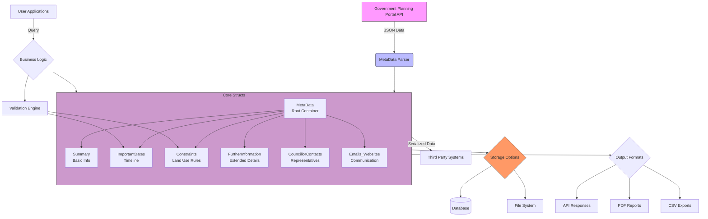

 # 🏛️ Planning Application Metadata Schema - Rust

This Rust module defines a structured representation of planning application data, as typically retrieved from a government portal (e.g., UK planning application sites). It is ideal for parsing, validating, storing, or transmitting planning application data in a well-typed format.

---

## 📦 Struct Overview

### 🔹 `MetaData`

The root struct that wraps all other components of a planning application.

```rust
pub struct MetaData {
    pub summary: Summary,
    pub important_dates: ImportantDates,
    pub constraints: Vec<Constraint>,
    pub further_information: FurtherInformation,
    pub councillor_contacts: Vec<CouncillorContact>,
    pub emails_websites: Emails_Websites
 
}

````

---

## 🧱 Component Structs

### 📝 `Summary`

Basic summary and reference data for the application.

| Field                  | Type   | Description                             |
| ---------------------- | ------ | --------------------------------------- |
| summary                | String | General description of the application  |
| application\_received  | String | Date the application was received       |
| appeal\_decision       | String | Decision on any appeals                 |
| decision               | String | Final decision made (e.g., "Grant")     |
| proposal               | String | Text of the proposed development        |
| application\_validated | String | Date of validation                      |
| status                 | String | Current status (e.g., "Approved")       |
| appeal\_status         | String | Status of any appeal                    |
| decision\_issued\_date | String | When the decision was officially issued |
| reference              | String | Unique application reference number     |
| address                | String | Site address                            |

---

### 📅 `ImportantDates`

Important chronological milestones for the application.

| Field                                 | Type            | Description |
| ------------------------------------- | --------------- | ----------- |
| application\_received\_date           | String          |             |
| application\_validated\_date          | String          |             |
| actual\_committee\_date               | Option\<String> |             |
| neighbour\_consultation\_expiry\_date | Option\<String> |             |
| standard\_consultation\_expiry\_date  | Option\<String> |             |
| latest\_advertisement\_expiry\_date   | Option\<String> |             |
| latest\_site\_notice\_expiry\_date    | Option\<String> |             |
| decision\_issued\_date                | String          |             |
| permission\_expiry\_date              | String          |             |
| determination\_deadline               | String          |             |
| temporary\_permission\_expiry\_date   | Option\<String> |             |

---

### 🚧 `Constraint`

Land or usage-based constraints for the property.

| Field            | Type            | Description                    |
| ---------------- | --------------- | ------------------------------ |
| name             | String          | Name of the constraint         |
| constraint\_type | String          | Type (e.g., "Green Belt")      |
| status           | Option\<String> | Constraint status if available |

---

### 🚧 `Emails_Websites`

| Field     | Type         | Description                  |
| --------- | ------------ | ---------------------------- | 
| emails    | Vec\<String> | Related email addresses      |
| websites  | Vec\<String> | Related external websites    |
| doc\_name | String       | Human-readable document name |

---

### 🔍 `FurtherInformation`

Additional metadata on the application and stakeholders.

| Field                                | Type            | Description                          |
| ------------------------------------ | --------------- | ------------------------------------ |
| application\_type                    | String          | Type of application (e.g., NMA)      |
| decision                             | String          | Outcome of the application           |
| actual\_decision\_level              | String          | Level at which it was decided        |
| expected\_decision\_level            | String          | Expected decision-making level       |
| case\_officer                        | String          | Officer handling the application     |
| parish                               | String          | Parish name                          |
| ward                                 | String          | Electoral ward                       |
| district\_reference                  | Option\<String> | External district reference (if any) |
| applicant\_name                      | String          | Applicant’s name                     |
| agent\_name                          | String          | Agent’s name                         |
| agent\_company\_name                 | String          | Agent's company                      |
| agent\_address                       | String          | Full address of the agent            |
| environmental\_assessment\_requested | bool            | Whether an EIA was required          |

---

### 🧑‍💼 `CouncillorContact`

Contact details for ward councillors involved with the application.

| Field   | Type   | Description             |
| ------- | ------ | ----------------------- |
| name    | String | Full name of councillor |
| address | String | Civic Centre address    |
| email   | String | Official council email  |

---

## 💡 Usage

You can use these structs to:

* Deserialize JSON responses from a government planning API using Serde
* Store parsed records into a database
* Build UIs for visualizing application statuses
* Perform validation or business logic on planning workflows

---

## ✅ Example (Dummy)

```rust
let metadata = MetaData {
    summary: Summary {
        summary: "Garage conversion".into(),
        application_received: "Mon 02 Jun 2025".into(),
        appeal_decision: "None".into(),
        decision: "Granted".into(),
        proposal: "Convert garage to living space".into(),
        application_validated: "Mon 02 Jun 2025".into(),
        status: "Approved".into(),
        appeal_status: "Not Appealed".into(),
        decision_issued_date: "Fri 20 Jun 2025".into(),
        reference: "DC/25/00414/NMA".into(),
        address: "Somewhere Lane, Gateshead, NE8".into(),
    },
    important_dates: ImportantDates {
        application_received_date: "Mon 02 Jun 2025".into(),
        application_validated_date: "Mon 02 Jun 2025".into(),
        actual_committee_date: None,
        neighbour_consultation_expiry_date: None,
        standard_consultation_expiry_date: None,
        latest_advertisement_expiry_date: None,
        latest_site_notice_expiry_date: None,
        decision_issued_date: "Fri 20 Jun 2025".into(),
        permission_expiry_date: "Thu 20 Jun 2030".into(),
        determination_deadline: "Mon 30 Jun 2025".into(),
        temporary_permission_expiry_date: None,
    },
    constraints: vec![
        Constraint {
            name: "Green Belt Policy E28".into(),
            constraint_type: "Green Belt".into(),
            status: None,
        },
    ],
    further_information: FurtherInformation {
        application_type: "Non Material Amendment".into(),
        decision: "Grant".into(),
        actual_decision_level: "Delegated Decision".into(),
        expected_decision_level: "Delegated Items".into(),
        case_officer: "Amy Dunbar".into(),
        parish: "Lamesley Parish Council".into(),
        ward: "Lamesley".into(),
        district_reference: None,
        applicant_name: "IVISON".into(),
        agent_name: "Mr DAVID PARSONS".into(),
        agent_company_name: "ARTISAN ARCHITECTURE".into(),
        agent_address: "ARTISAN ARCHITECTURE SOUTH SHIELDS BUSINESS WORKS HENRY ROBSON WAY STATION ROAD SOUTH SHIELDS NE33 1RF".into(),
        environmental_assessment_requested: false,
    },
    councillor_contacts: vec![
        CouncillorContact {
            name: "Councillor S Gallagher".into(),
            address: "Civic Centre Regent Street Gateshead NE8 1HH".into(),
            email: "cllr.sgallagher@gateshead.gov.uk".into(),
        },
    ],
    email_websites: {
        doc_name: "Main Planning Document".to_string(),
        emails: vec![
            "planning@gov.uk".to_string(),
            "agent@example.com".to_string(),
        ],
        websites: vec![
            "https://planning.gov.uk/docs/123".to_string(),
            "https://example.com/agent".to_string(),
        ],
    }
};
```

---
Here's a comprehensive macro-level architecture diagram for your planning application metadata system in Mermaid format, along with an explanation:



### Diagram Explanation:

1. **Data Flow** (Blue arrows):
   - Starts with government API as the data source
   - Flows through parser into core Rust structs
   - Branches to storage and output formats

2. **Core Structs** (Purple box):
   - Shows `MetaData` as the root container
   - Illustrates relationship with all component structs
   - Each component maps to your defined structs

3. **System Capabilities** (Orange boxes):
   - Storage options (database/filesystem)
   - Multiple output format generation
   - Integration with business logic

4. **Key Interactions**:
   - Green validation engine ensuring constraint rules
   - Pink user applications making queries
   - External system integrations

### Key Architectural Features Represented:

1. **Modular Design**:
   - Clear separation between data ingestion (parser)
   - Core domain model (your structs)
   - Output adapters (API/PDF/CSV)

2. **Extensibility Points**:
   - New storage options can be added
   - Additional output formats supported
   - Validation rules can be extended

3. **Real-world Usage**:
   - Government API → Your System → End Users
   - Support for both automated and manual processes

This diagram communicates:
- How raw data becomes structured information
- Where your Rust structs fit in the bigger picture
- All major system capabilities at a glance
- Key integration points with other systems

Would you like me to add any specific:
- Sequence diagrams for particular workflows?
- Database schema relationships?
- API endpoint mappings?
